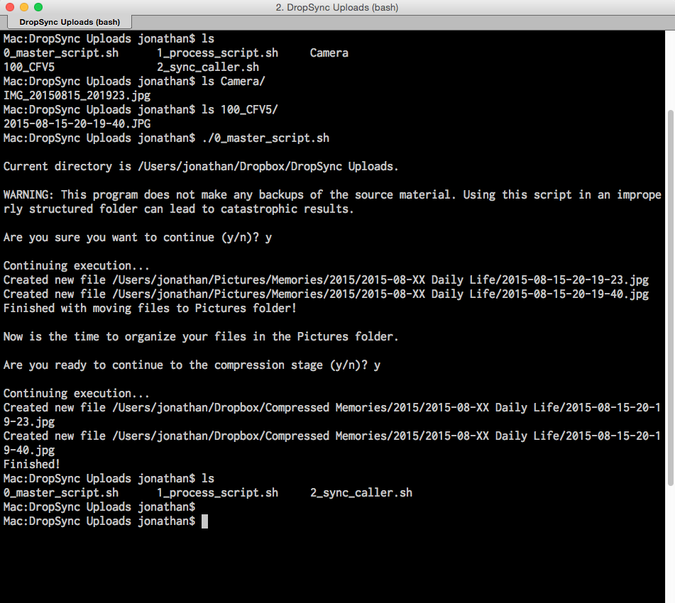

# Photo Tidying Script
Example of using BASH scripting to tidy photos and videos in a hot folder, rename different file name formats to a uniform format, sort them into monthly folders in a photo library, and then generate a compressed copy for mobile devices. Uses ImageMagick for photo conversions.

Date authored: June 25, 2015

##### Demo execution process:

